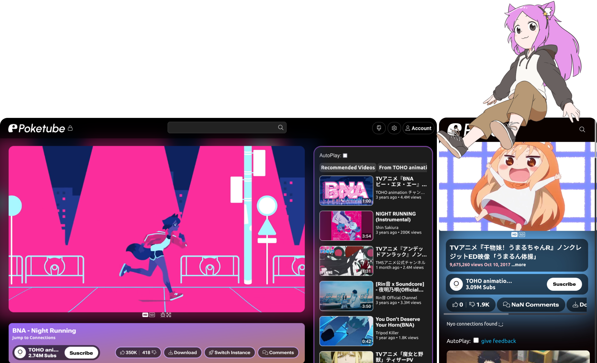
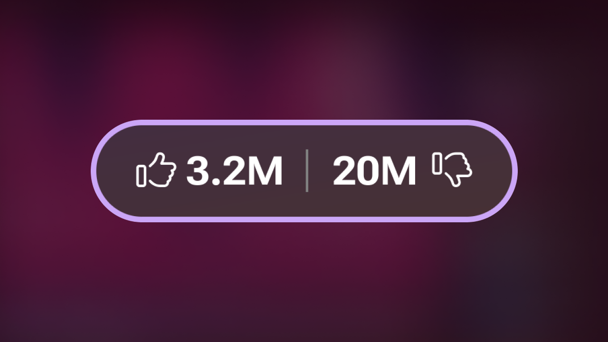
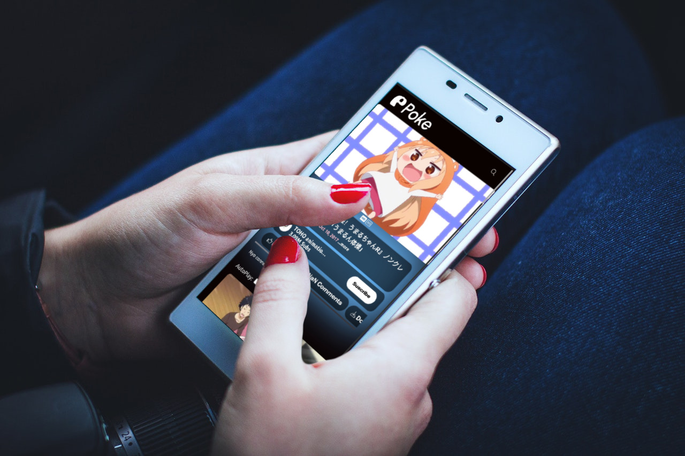

<h1 align="center">
  
  
  
PRIVACY APP OF YOUR DREAMS! :3

</h1>

  
Be anonymous while watching (cat falling) videos, searching the web, and listening to music on Poke - the free privacy front-end!

  <a href="#welcome">Welcome!</a>&nbsp;&nbsp;|&nbsp;&nbsp;<a href="#features">Features</a>&nbsp;&nbsp;|&nbsp;&nbsp;<a href="#no-non-free-codec-needed">No Non-Free Codec</a>&nbsp;&nbsp;|&nbsp;&nbsp;<a href="#hosting-poke">Hosting</a>&nbsp;&nbsp;|&nbsp;&nbsp;<a href="#poke-community">Community</a>&nbsp;&nbsp;|&nbsp;&nbsp;<a href="#legal">Legal</a>
    
  
  
  

## Welcome!

Welcome to Poke (formerly PokeTube), the privacy-friendly YouTube front-end built with the InnerTube API! Imagine paying for YouTube Premium just to download videos - couldn't be us (literally).

## Features

|  | 
<h3>🔙 Built-In Return YouTube Dislikes</h3>See the dislikes from *returnyoutubedislike* - because sometimes you need to know how bad that video really is :3
 |
| - | - |
| 
<h3>📱 PWA Support</h3>With PWA Support, you can install Poke on your mobile device. Now you can pretend to be productive while watching cat videos on the go, mreoww! :3
 |  |
| <h3>🎨 Customize</h3>Customize Poke however you want. Make it as unique as your taste in memes. | <h3>📥 Accounts</h3>Suscribe (yes Suscribe hehe sussy baka) to whaever channel you want! 
 |
| <h3>🔍 Web Search</h3>Search the web privately on PokeTube. Incognito mode who? | <h3>🎶 And...</h3>Ambient mode, HQ audio, and even more! :3 |

## No Non-Free Codec Needed

Poke uses OpenH264, which is free software! No non-free components included :3 View the source code of OpenH264 [here](https://github.com/cisco/openh264.git). Because who wants to deal with non-free stuff? Not us!~

## Hosting Poke

### NodeJS

1. **Install Packages**
   - Fedora/RHEL: `$ sudo dnf install git make gcc libcurl nodejs python libcurl4 g++`
   - Debian/Ubuntu: `$ sudo apt install git make gcc libcurl4-openssl-dev nodejs npm python g++`

2. **Clone Repo**
   - Codeberg: `$ git clone https://codeberg.org/ashley/poke.git`
   - GitHub: `$ git clone https://github.com/ashley0143/poke.git`
    
    unoffical mirrors:
   - code.lgbt: `$ git clone https://code.lgbt/mirror/poke.git` [sync every 10mins]
   - git.lgbt: `$ git clone https://git.lgbt/mirror/poke.git` [sync every 10mins]
   - nin0git :`$ git clone https://git.nin0.dev/mirrors/poke.git` [sync every 10mins]
   - SudoVanilla: `$ git clone https://ark.sudovanilla.org/Korbs/poke.git` [sync every update]

3. **Install Dependencies**
   - `$ cd poke`
   - `$ npm install`

4. **Start Server**
   - `$ node server.js`

   Congrats! PokeTube should now be running on `localhost:6003`! 🎉

### Docker

1. **Create Directory**
   - `$ mkdir poketube && cd poketube`

2. **Download Config**
   - `$ curl -O https://codeberg.org/Ashley/poke/raw/branch/main/docker-compose.yml`

3. **Run Poke**
   - `$ docker compose up -d`

   Congrats! PokeTube should now be running on `localhost:6003`! 🎉

## Poke Community

Join us on [Discord](https://discord.poketube.fun/) or [Matrix](https://matrix.to/#/#poke:vern.cc)! I promise we're cool! <3

 

## The Legal Stuff (boring tbh)
the main parts of the project is Under GPL-3.0-OR-LATER :3

see the each sections LICENSE tho!!
Copyleft 2021-202x Poke Project

[Code Of conduct](https://codeberg.org/Ashley/poke/src/branch/main/CODE_OF_CONDUCT.md)

[Privacy Policy](https://poketube.fun/privacy)

TL;DR: we dont collect or share your personal info, that's it lol.

We use the GNU Coding Standard Thingy, see [this link.](https://www.gnu.org/prep/standards)

  
Parts of Poke are hosted on Glitch.com since <i>2020</i>.

  
   

  
 this software does not support <a href="https://opensource.org">"OSI"</a> - <a href="https://rationalwiki.org/wiki/Eric_S._Raymond#Open_Source">they are terrible people </a> - pls support the FSF/GNU (<a href="https://fsf.org">fsf.org</a> or <a href="https://gnu.org">gnu.org</a>) instead :3 

  

